## Deep Learning Drone Simulator ##
[image_0]: ./misc/FollowMeGif.gif
![alt text][image_0] 

This [Udacity clone project](https://github.com/udacity/RoboND-DeepLearning.git)  is to  learn  how to build a neural network
 and how all the individual pieces function together to form a powerful decision-making drone machine.

**TensorFlow**  which is a robust software framework developed by Google to facilitate building deep neural networks is 
used to abstract away many of the finer details and make life easier are used in this project. However, it is important 
to have a firm grasp of the fundamentals to understand the choices needed to make in setting various parameters or 
how to improve the performance of the neural network.


### What is Deep learning and what it is used for?
The heart of deep learning has to do with something call Neural Networks. Neural networks vaguely mimic the process of 
how the brain operates with neurons that fire bits of information. 
For example,There's a child playing in the sand with some read an blue shells and we ask the child.
 Can you draw a line that separates the red and the blue shells? And the child will draw a line. 

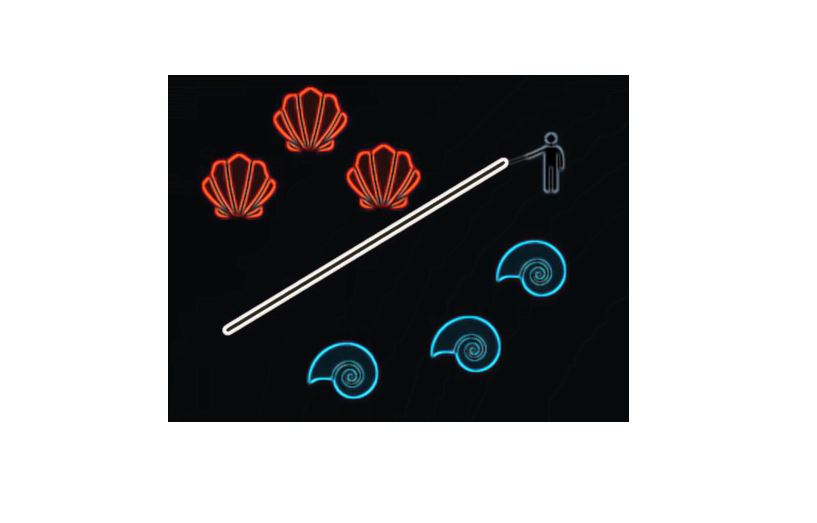

That's what a neural network does. Given some data in the form of blue or red points, the neural network will look for the best line that separates them.
And if the data is a bit more complicated then we'll need a more complicated algorithm. Here, a deep neural network will do the job and find the more complex boundary that separates the points.

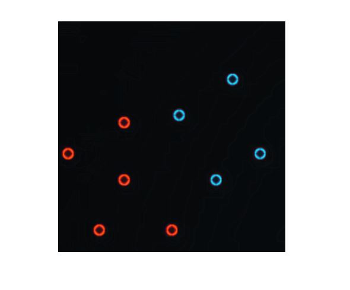

If the data is a bit more complicated, then we'll need a more complicated algorithm. Here, a deep neural network will do the job and find the more complex boundary that separates the points.

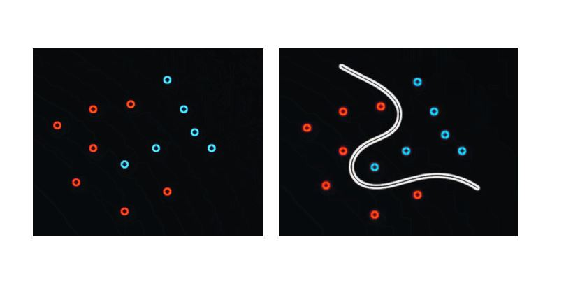

## Implement the Segmentation Network

### Semantic Segmentation
Semantic Segmentation is the task of assigning meaning to a part of an object.
This can be done at the pixel level where we assign each pixel to a
target class such as road, car, pedestrian, sign, or any number
of other classes. Semantic segmentation helps us derive valuable information
about every pixel in the image rather than just slicing sections into bounding boxes.
This is a field known as scene understanding, and it's mainly relevant to autonomous vehicle.
Full scene understanding help with perception, which enables vehicles to make decisions.

 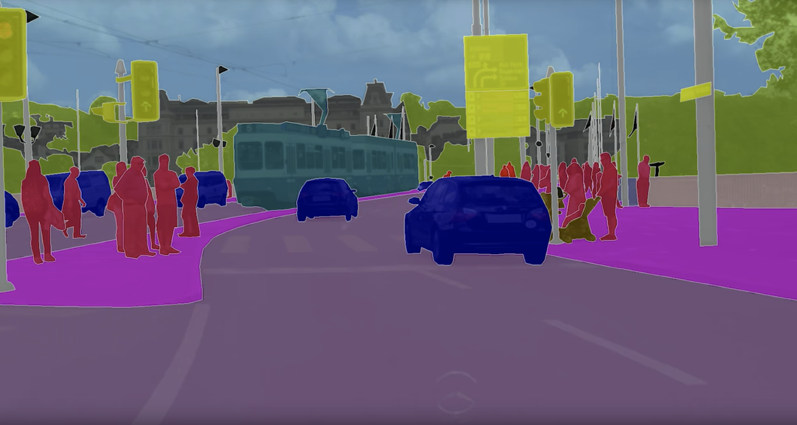


### Bounding Boxes
They are a simple method of scene understanding compared to segmentation.
In neural network, just has to figure out, where an object is and draw a type box around it.
There are already significant open source state of the art solution, such as **YOLO** and **SSD** models.
These models perform extremely well even at a high frame per second.
They're useful for detecting different objects such as cars, people, traffic lights, and other objects in the scene.

 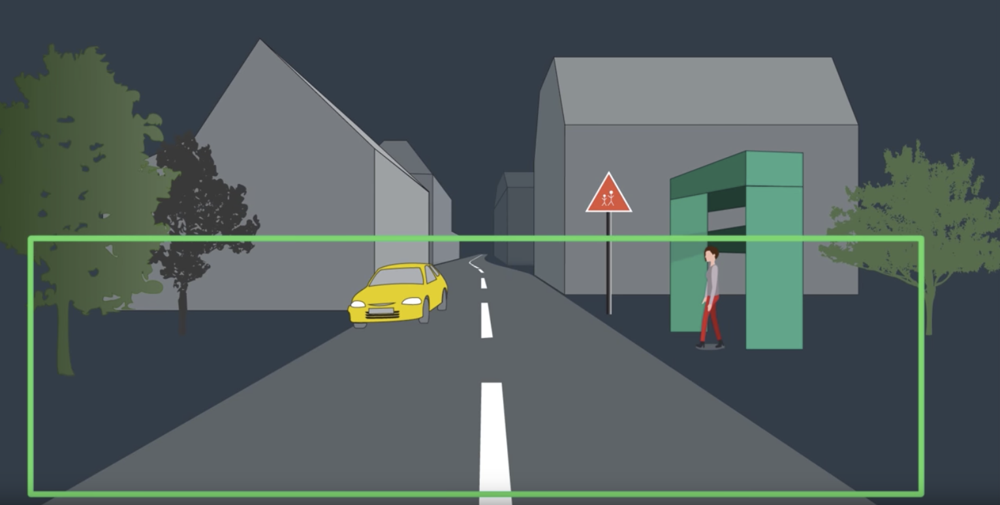
However, bounding boxes have their limits. Imagine drawing and bounding
box around a curvy road, the forest, or the sky; this quickly becomes problematic
 or even impossible to convey the true shape of an object. At best, bounding boxes
 can only hope to achieve partial seen understanding which is why we use semantic segmentation in this project.

  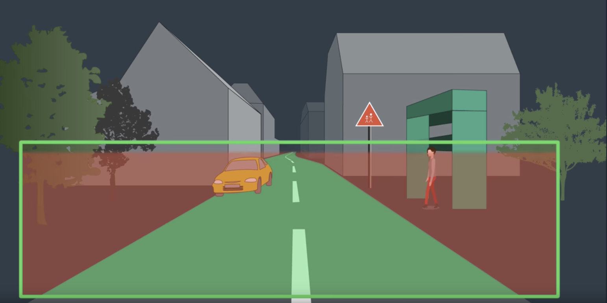

A full convolution network(FCN) is used to train the semantic segmentation model.
It contains three encoder blocks, a 1x1 convolution layer, and three symmetrical decoder blocks.


 ###### Fully Convolutional network code snippet
```python

def fcn_model(inputs, num_classes):

    # Add Encoder Blocks.
    filter = 96
    encoder_one = encoder_block(inputs,filter,2)
    encoder_two = encoder_block(encoder_one,filter *2, 2)
    encoder_three = encoder_block(encoder_two,filter*4,2)

    # Add 1x1 Convolution layer using conv2d_batchnorm().
    one_to_one_convolution = conv2d_batchnorm(encoder_three,filter*4,kernel_size=1,strides =1)

    # Add the same number of Decoder Blocks as the number of Encoder Blocks
    decoder_three = decoder_block(one_to_one_convolution,encoder_two,filter *4)
    decoder_two = decoder_block(decoder_three,encoder_one,filter *2)
    decoder_one = decoder_block(decoder_two,inputs,filter)


    # The function returns the output layer of the model. decoder_one is the final layer obtained from the last decoder_block()
    return layers.Conv2D(num_classes, 3, activation='softmax', padding='same')(decoder_one)

```

### What is a Fully Convolutional Network?

A typical convolutional neural network might consist of a series of convolution layers.
Followed by fully connected layers and ultimately a softmax activation function.
It's a great architecture for a classification task.For example, is this a picture of a hotdog?

  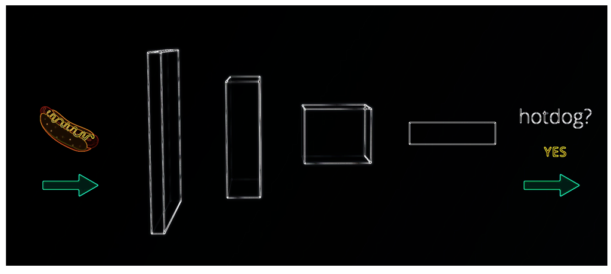

But question we want to answer is where in a picture is the hotdog? The question is much more
difficult to solve since fully connected layers don't preserve spatial information.
However if, we change the  C from connected to convolutional, we can
integrate convolutions directly into the layer to create fully convolutional network.
It help us answer where is the hotdog question because while doing the
convolution they preserve the spatial information throughout the entire network.
Additionally,  since convolutional operations fundamentally don't care about the size of the input,
a fully convolutional network will work on images of any size.


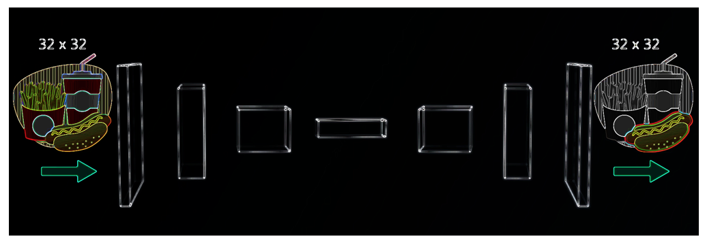

Fully Convolutional Networks have  achieved state of the art results in
computer vision tasks such as semantic segmentation.
FCNs take advantage of 3 special techniques:

1. Replace fully connected layers with 1x1 convolutional layers
2. Up-sampling through the use of transposed convolutional layers
2. Skip Connection - These skip connection allow the network to use
information from multiple resolution scales. As a result, the network is able to make more precise segmentation decisions.

#### No Skip Connection


#### Skip Connection


### Structurally a FNC
Structurally a FCN is usually comprised of two parts: encoder and decoder.
* The encoder is a series of convolutional layers like **VGG** and **ResNet**.
The goal of the encoder is to extract features from the image.
* The decoder up-scale the output of the encoder such that it's the same
size as the original image. Thus, it results in segmentation or prediction
of each individual pixel in the original image.

###### Encoder code snippet
```python
def encoder_block(input_layer, filters, strides):

    # Create a separable convolution layer using the separable_conv2d_batchnorm() function.
    output_layer = separable_conv2d_batchnorm(input_layer, filters, strides)
    return output_layer
```


###### Decoder code snippet
```python
def decoder_block(small_ip_layer, large_ip_layer, filters):

    # Upsample the small input layer using the bilinear_upsample() function.
    upsample = bilinear_upsample(small_ip_layer)
    # Concatenate the upsampled and large input layers using layers.concatenate
    concatenate_upsample = layers.concatenate([upsample,large_ip_layer])
    # Add some number of separable convolution layers
    output_layer = separable_conv2d_batchnorm(concatenate_upsample,filters,1)
    output_layer = separable_conv2d_batchnorm(output_layer,filters,1)
    return output_layer
```

### Hyperparameters
The Hyperparameters use in this project is:
```
learning_rate = 0.01
batch_size = 15
num_epochs = 60
steps_per_epoch = 200
validation_steps = 50
workers = 2
```

* learning_rate: Started at 0.01 and the network had no problem with that value
* batch_size: is the number of training samples/images that get propagated through the network in a single pass. It is set to 15 because one of the 2 Nvidia GTX 1070 kept crashing because of low memory
* num_epochs: number of times the entire training dataset gets propagated through the network. This value is set to 60.
* steps_per_epoch: number of batches of training images that go through the network in 1 epoch.This value is set to 200.
* validation_steps: number of batches of validation images that go through the network in 1 epoch. This is similar to steps_per_epoch, except validation_steps is for the validation dataset. This value is set to 50.
* workers: maximum number of processes to spin up. This can affect your training speed and is dependent on your hardware. This value is set to 2.

With 2 NVDIA GTX 1070 and the hyperparameters settings above, it took almost 3 hours to train the model.

**Note**: See the model_training Jupyter Notebook located in the [code folder](./code) or the html page located in the
[html folder](./html) for more information about the implementation of the segmentation network.


## Setup Instructions
### Prerequisites
Python 3.5 and Jupyter Notebooks is needed for this project.  The best way to get setup with these is to use Anaconda, the [RoboND-Python-Starterkit](https://github.com/ryan-keenan/RoboND-Python-Starterkit) and use [PyCharm IDE](https://www.jetbrains.com/pycharm/) for coding and debugging.
Here is a great link for learning more about [Anaconda and Jupyter Notebooks](https://classroom.udacity.com/courses/ud1111)

Note: if you have a recent version of the RoboND environment then these packages should already be installed.

#### OS X and Linux (Ubuntu)source activate RoboND
pip install tensorflow==1.2.1
pip install socketIO-client
pip install transforms3d
pip install PyQt5
pip install pyqtgraph

#### Windows source activate RoboND
if the above throws an error, you can run "activate RoboND" instead
* pip install tensorflow==1.2.1
* pip install socketIO-client
* pip install transforms3d
* pip install PyQt5
* pip install pyqtgraph

### Download the data

Save the following three files into the data folder of the cloned repository.

[Training Data](https://s3-us-west-1.amazonaws.com/udacity-robotics/Deep+Learning+Data/Lab/train.zip)

[Validation Data](https://s3-us-west-1.amazonaws.com/udacity-robotics/Deep+Learning+Data/Lab/validation.zip)

[Sample Evaluation Data](https://s3-us-west-1.amazonaws.com/udacity-robotics/Deep+Learning+Data/Project/sample_evaluation_data.zip)

### Download the QuadSim binary

To interface your neural net with the QuadSim simulator, you must use a version QuadSim that has been custom tailored for this project. The previous version that you might have used for the Controls lab will not work.

The simulator binary can be downloaded [here](https://github.com/udacity/RoboND-DeepLearning/releases/latest)

## Data Collection
Good data is just as important as a good network architecture therefore collecting the best data is the key to success

Open quad sim, put a check mark in **_Spawn crowd_**, then click on **_DL training_**
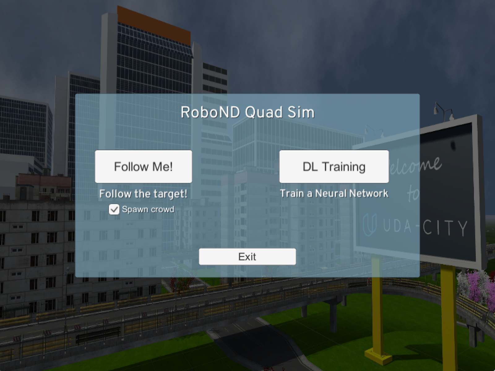

### Local control mode
The quad will start out in patrol mode, but since we have not added any waypoints yet, it will have nowhere to go.
 To add waypoints we must first switch to local control by pressing the H key.
 
 
### View and Navigation
* To zoom out from the quad, we recommend using the **_mouse wheel_**.
* To change the viewing perspective at any time during training, **_right click_** on the screen and move the mouse.
* Use **_WASD_** keys to move the quad forward, left, back and right
* Use **_<space>_** and **_C_** to thrust up and down
* Use **_QE_** keys to turn the quad toward the left or right
* Press **_G_** to reset it to the starting pose.
To look up these and other commands press the **_L_** legend key

 
 
 ### Managing data collection
There are three major aspects to the data collection process that you can control in order determine the type of data you collect. These are as follows:

1. The path the quad will take while on patrol.
2. The path the hero will walk.
3. The locations of distractor spawn.

### Setting Patrol Points
Press the **_P_** key to set a patrol point. A green patrol point will appear at the quads position.
 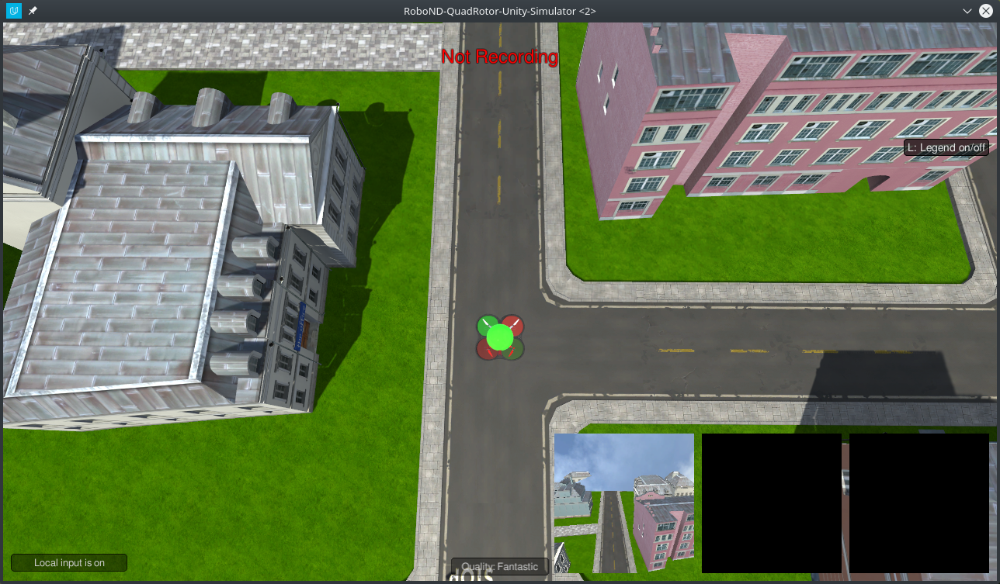
 
 Move to another position and press P again to add one more patrol point somewhere nearby.
 
  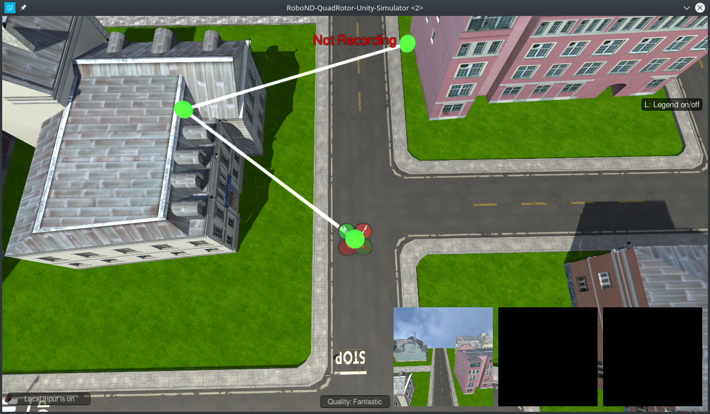
  
 We can now put the quad into patrol mode by pressing **_H_**. To switch back to local control press H again.
 To remove all the patrol points you have set press **_L_**
   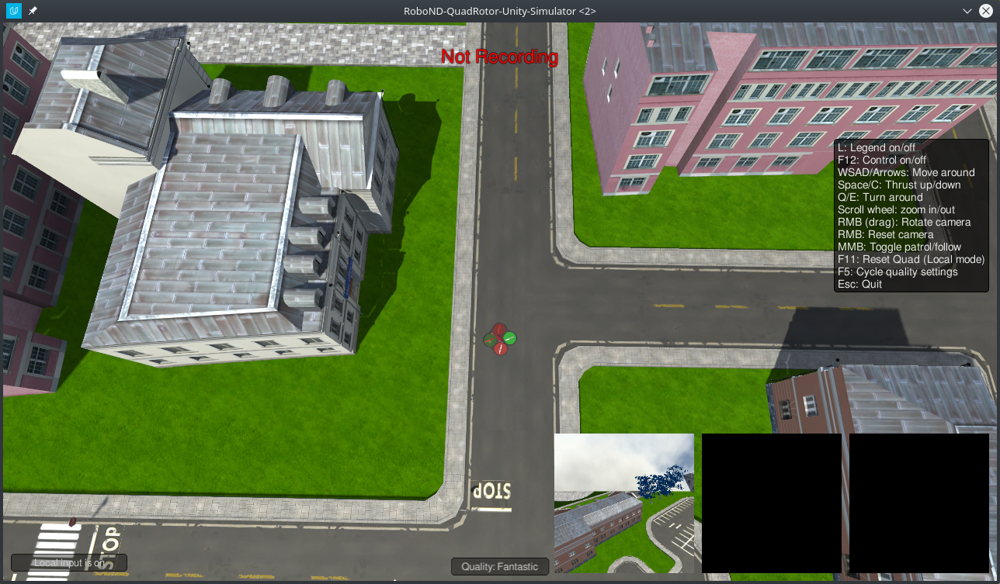
 
### Setting the Hero (Person that the Drone will be following)
To set a hero path point press **_O_** while in local control mode. The hero path points are very similar to the patrol points,
 except they are always placed at ground level. Decrease the quads altitude by pressing **_C_** to get a better look at 
 the points you are setting. Similar to patrol points, all the hero path points can be removed by pressing **_K_**. 
 The hero will start at the first point you create and walk around the path. When reaching the end, 
the hero will despawn before reappearing at the beginning of the path.

   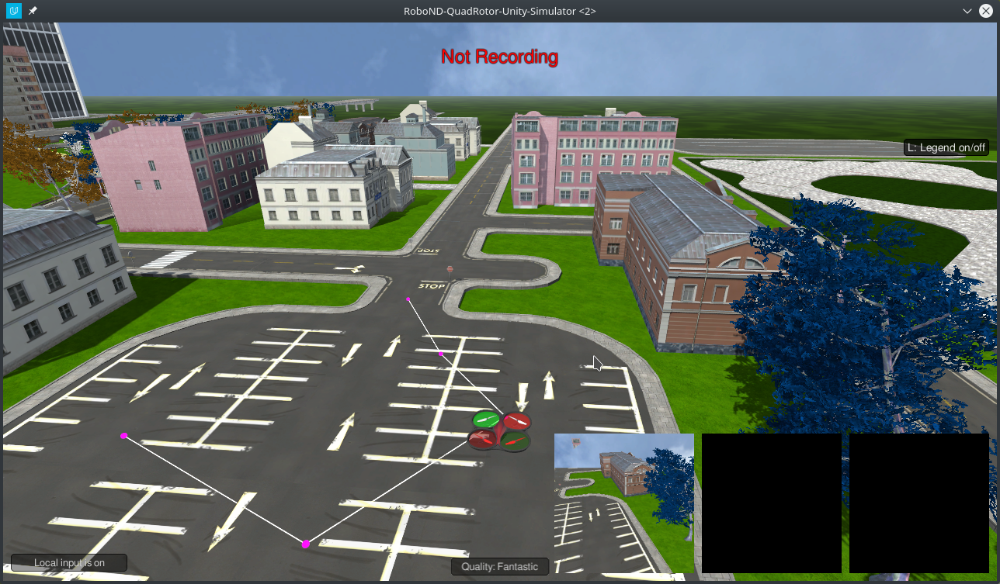
   
### Setting Spawn points
All the characters in the sim except the hero will respawn after 30-50 seconds at one of the spawn points. 
We can control the number of people in a given area by the number and location of the spawn points we place. 
We can set a spawn point at the quads current x,y position by pressing the **_I_** key. 
Blue markers will appear at the spawn locations. We can remove all the spawn points by pressing **_J_**

   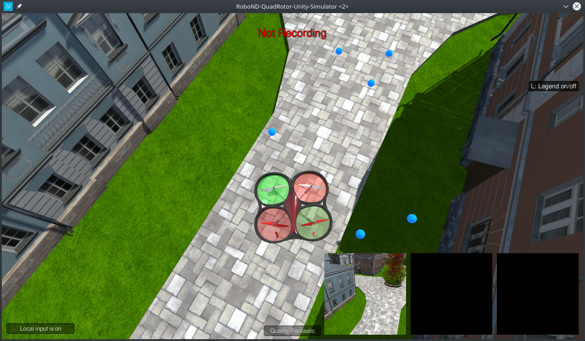

### Setting up a Data collection Run
For setting spawn and hero path points it is helpful to rotate the camera so you are viewing the quad from directly above.

   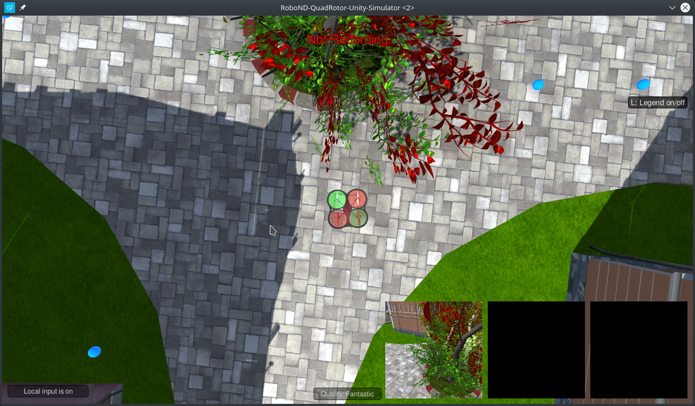
   
To start let's create a small collection experiment. Often it will be the case that we will want to run multiple collection
 runs and have each run target a specific type of data. It will also be necessary to have a significant sample of data containing the hero. 
If we create a very large patrol path and hero path it will be unlikely that we will collect many images containing the hero.

   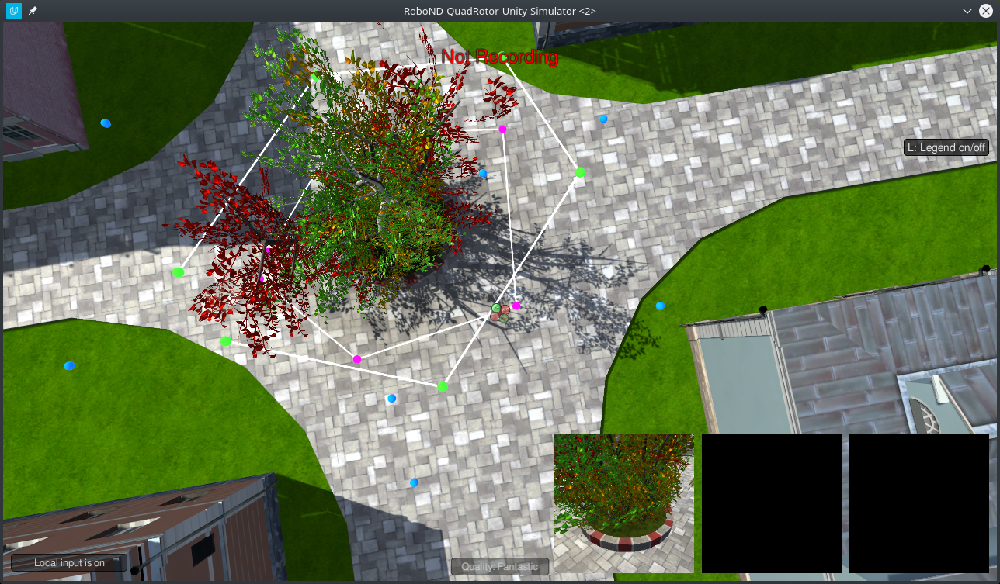
   

### Starting the Collection Run
When we are satisfied with how we have placed the patrol path, hero path, and spawn points, press M to have people
 start spawning.
 
  
 
 To start recording data press the **_R_** key. Navigate to the **raw_sim_data/train/target** We are using the target directory
  because we have elected to have the hero appear in this collection run. Alternatively randomly chosen people can take the role of the hero.
 In this in order to have the data preparation turn out correctly we would select the **non_target folder**.
 
 Press **_H_** to have the quad enter patrol mode. To speed up the data collection process, press the **_9_** key. 
 Data from this run will be stored in the folder selected.
When we are done collecting data, we can press **_R_** again to stop recording. While it is not advisable to add/remove
 the hero path/spawn points while the data collection is running, we can delete the patrol path and modify it if desired.

To reset the sim, press **_ESC_**

### Data Structure
The data directory is organized as follows:
```
data/runs - contains the results of prediction runs
data/train/images - contains images for the training set
data/train/masks - contains masked (labeled) images for the training set
data/validation/images - contains images for the validation set
data/validation/masks - contains masked (labeled) images for the validation set
data/weights - contains trained TensorFlow models

data/raw_sim_data/train/run1
data/raw_sim_data/validation/run1
```

### Validation Set
To collect the validation set, repeat both sets of steps above, except using the directory `data/raw_sim_data/validation` instead rather than `data/raw_sim_data/train`.

### Image Preprocessing
Before the network is trained, the images first need to be undergo a preprocessing step. The preprocessing step transforms the depth masks from the sim, into binary masks suitable for training a neural network. It also converts the images from .png to .jpeg to create a reduced sized dataset, suitable for uploading to AWS.
To run preprocessing:
```
$ python preprocess_ims.py
```
**Note**: If your data is stored as suggested in the steps above, this script should run without error.

**Important Note 1:**

Running `preprocess_ims.py` does *not* delete files in the processed_data folder. This means if you leave images in processed data and collect a new dataset, some of the data in processed_data will be overwritten some will be left as is. It is recommended to **delete** the train and validation folders inside processed_data(or the entire folder) before running `preprocess_ims.py` with a new set of collected data.

**Important Note 2:**

The notebook, and supporting code assume your data for training/validation is in data/train, and data/validation. After you run `preprocess_ims.py` you will have new `train`, and possibly `validation` folders in the `processed_ims`.
Rename or move `data/train`, and `data/validation`, then move `data/processed_ims/train`, into `data/`, and  `data/processed_ims/validation`also into `data/`

**Important Note 3:**

Merging multiple `train` or `validation` may be difficult, it is recommended that data choices be determined by what you include in `raw_sim_data/train/run1` with possibly many different runs in the directory. You can create a tempory folder in `data/` and store raw run data you don't currently want to use, but that may be useful for later. Choose which `run_x` folders to include in `raw_sim_data/train`, and `raw_sim_data/validation`, then run  `preprocess_ims.py` from within the 'code/' directory to generate your new training and validation sets.

 
## Training, Predicting and Scoring ##
With your training and validation data having been generated or downloaded from the above section of this repository, you are free to begin working with the neural net.

**Note**: Training CNNs is a very compute-intensive process. If your system does not have a recent Nvidia graphics card, with [cuDNN](https://developer.nvidia.com/cudnn) and [CUDA](https://developer.nvidia.com/cuda) installed , you may need to perform the training step in a AWS cloud.

## Scoring ##

To score the network on the Follow Me task, two types of error are measured. First the intersection over the union for the pixelwise classifications is computed for the target channel. 

In addition to this we determine whether the network detected the target person or not. If more then 3 pixels have probability greater then 0.5 of being the target person then this counts as the network guessing the target is in the image. 

We determine whether the target is actually in the image by whether there are more then 3 pixels containing the target in the label mask. 

Using the above the number of detection true_positives, false positives, false negatives are counted. 

**How the Final score is Calculated**

The final score is the pixelwise `average_IoU*(n_true_positive/(n_true_positive+n_false_positive+n_false_negative))` on data similar to that provided in sample_evaulation_data

**Note**: See the model_training Jupyter Notebook located in the [code folder](./code) or the html page located in the
[html folder](./html) for more information and to see the Score.

## Experimentation: Testing in Simulation

1. Launch the simulator, select "Spawn People", and then click the "Follow Me" button.
2. Run the realtime follower script
```
$ python follower.py model_weights.h5
```

**Note:** If you'd like to see an overlay of the detected region on each camera frame from the drone, simply pass the `--pred_viz` parameter to `follower.py`

## Enhancements
* More data images can be added to the training to improve the learning and descrease ofer fitting
* The performance of the FCN can still can improve by add more layers and larger filter sizes.
* For the training to be faster, we can add more GPUs
